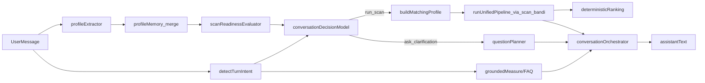

## CURRENT FLOW

### End-to-end path

- **Frontend entry (`ChatWindow`)**: `[components/chat/ChatWindow.tsx](components/chat/ChatWindow.tsx)`
  - Maintains React state for `messages`, `profile` (local `UserProfile`), `step`, `isTyping`, `isScanning`, and some refs.
  - On user send (`onSend`):
    - Appends a user `ChatMessage`.
    - Calls `POST /api/conversation` with `{ message }`.
    - Expects a `ConversationResponse` JSON with:
      - `userProfile`: structured profile fields.
      - `step`: current profiling step (`activityType`, `sector`, `location`, ..., `ready`).
      - `assistantText`: textual reply.
      - `readyToScan`: boolean gate.
      - Optional `mode`, `nextBestField`, `nextQuestionField`, `assistantConfidence`, `needsClarification`, `profileCompletenessScore`, `scanReadinessReason`.
    - After response: updates `profile` and `step`, appends the assistant text (unless it looks like a dumb echo), and if `readyToScan` and the profile hash changed, calls `runScan`.
- **Conversation API (server)**: `POST /api/conversation` (implementation not directly visible, but strongly constrained by tests and the patch in `cursor-preflight-wip.patch`).
  - Keeps a **session cookie** (`bndo_assistant_session`), as seen in `scripts/check-conversation-*.mjs` and `scripts/test-e2e-conversation.mjs`.
  - Loads and stores a `Session` (`step`, `userProfile`, `profileMemory`, `lastScanHash`, `askedCounts`, `qaMode`, etc.) per `lib/conversation/types.ts`.
  - Core steps per turn (inferred from helpers and tests):
    1. **Intent detection** via `detectTurnIntent` in `[lib/conversation/intentRouter.ts](lib/conversation/intentRouter.ts)`:
      - Computes booleans (`questionLike`, `smallTalk`, `greeting`, `conversationalIntent`, `questionsFirst`, `proceedToMatching`, `asksHumanConsultant`, `directQuestionOnMeasure`, `eligibilityCheck`, `discovery`, `measureQuestion`) and `modeHint` (`'qa' | 'handoff_human' | 'profiling' | 'small_talk' | 'scan_refine' | 'discovery' | 'measure_question'`).
      - Uses `isDirectMeasureQuestion` from `groundedMeasureAnswerer` for measure-specific questions.
    2. **Deterministic extraction** via `extractProfileFromMessage` in `[lib/engines/profileExtractor.ts](lib/engines/profileExtractor.ts)`:
      - Parses region/demonym, budget, requested contribution, employees, `businessExists`, age/ageBand, employment status, legal form, email, phone, `activityType`, `sector`, `fundingGoal`, contribution preference, ATECO, etc.
      - Returns `updates` + `slotSource` (explicit/demonym/inferred) to be merged into the server-side `userProfile`.
    3. **Profile memory** via `[lib/conversation/profileMemory.ts](lib/conversation/profileMemory.ts)`:
      - Tracks per-field `lastUpdatedAt` and `source` (`user | extractor | system`).
      - `getChangedFields(prev, next)` returns `NextBestField[]` so the conversation can reason about what changed in this turn.
      - `summarizeProfileForPrompt(profile)` flattens the profile into a concise, semi-structured string for prompts.
    4. **Question planning** via `[lib/conversation/questionPlanner.ts](lib/conversation/questionPlanner.ts)`:
      - `nextBestFieldFromStep(step)` maps `Step` → `NextBestField`.
      - `questionFor(step, seed, attempt)` and `naturalBridgeQuestion(step, attempt)` generate Italian variants of field-specific questions and short “bridges”.
    5. **Repetition & tone**:
      - `repetitionGuard` (via `similarityScore` / `findClosestSimilarReply` in `[lib/conversation/repetitionGuard.ts](lib/conversation/repetitionGuard.ts)`) de-duplicates near-identical responses.
      - `applyTonePolicy` in `[lib/conversation/tonePolicy.ts](lib/conversation/tonePolicy.ts)` enforces: stripped markdown, max length, single question mark, de-roboticized openings, etc.
      - `composeAssistantReply` in `[lib/conversation/responseComposer.ts](lib/conversation/responseComposer.ts)` merges `directAnswer`, `recap`, and `bridgeQuestion` into a single short reply, again with a single question.
    6. **Knowledge/measure layer**:
      - `answerGroundedMeasureQuestion` + `isDirectMeasureQuestion` in `[lib/knowledge/groundedMeasureAnswerer.ts](lib/knowledge/groundedMeasureAnswerer.ts)` implement **deterministic** answers for named measures (Resto al Sud 2.0, Autoimpiego Centro-Nord) with cautious outcomes (`yes | no | yes_under_conditions | not_confirmable`) and short texts.
      - `buildKnowledgeContext` and `answerFaq` in `[lib/knowledge/regoleBandi.ts](lib/knowledge/regoleBandi.ts)` add finance FAQs and method explanations without calling the scanner.
      - `resolveMeasureUpdateReply` + `isMeasureUpdateQuestion` in `[lib/knowledge/measureStatus.ts](lib/knowledge/measureStatus.ts)` hit the public incentivi.gov Solr index to check **measure existence and high-level status**, returning a fully-formed reply string.
    7. **LLM text generation**:
      - `generateAssistantTextWithOpenAI` in `app/api/conversation/route.ts` (patched in `cursor-preflight-wip.patch`):
        - Receives a system prompt and contextual strings (`knowledgeContext`, `profileSummary`, last turns, `questionHint`, etc.).
        - Instructions already say: “rispondi prima alla domanda concreta, poi se serve chiedi UN solo dato critico”, and updated text emphasizes grounded measure answers and conservative behaviour.
      - Conversation route decides whether to **bypass OpenAI** for deterministic flows (`shouldBypassOpenAI`) based on flags like `shouldScanNow`, `AI_CHAT_V2_ENABLED`, `CHAT_DETERMINISTIC_V3`, `faqLikeTurn`, `measureUpdateReply`.
    8. **Scan readiness & decision** (inferred from tests):
      - Conversation route derives `readyToScan`, `scanReadinessReason` and `needsClarification` based on:
        - Which fields are present in `userProfile` (fundingGoal, location, age/ageBand, employmentStatus, businessExists, etc.).
        - Intent (`modeHint`, `qaModeActive`, `discovery`, `proceedToMatching`).
        - Progress vs previous step and `askedCounts` (to avoid loops).
      - Tests in `scripts/check-conversation-readiness.mjs` and `scripts/check-conversation-quality.mjs` assert:
        - South-under35-Calabria startup profile becomes `readyToScan` after a few messages.
        - Generic “voglio un bando” is **not** ready and must request clarification.
        - The assistant never asks the same `nextQuestionField` more than twice in a row, and each reply has **≤1 question**.
      - `shouldAttemptStepAnswer(step, message, isNewSession)` in `route.ts` controls whether to interpret a message as an answer to the current step at all.
    9. **Confidence metadata** via `[lib/engines/confidenceMetadata.ts](lib/engines/confidenceMetadata.ts)`:
      - Pure metadata: from `aiSource` and `needsClarification` to `assistantConfidence` in `[0,1]`; doesn’t gate behaviour.
  - Final JSON response contains `userProfile`, `step`, `assistantText`, `readyToScan`, `needsClarification`, `nextQuestionField`, `scanReadinessReason`, etc., which drive the frontend.
- **Scan path (`/api/scan-bandi`)**:
  - Originates from `runScan` in `[components/chat/ChatWindow.tsx](components/chat/ChatWindow.tsx)`:
    - Builds `scanProfile` from chat `UserProfile` (normalizes nulls, ensures location shape).
    - Chooses `mode`: `'full'` if there is at least a `fundingGoal` or `sector` and a `region`, else `'fast'`.
    - Calls `POST /api/scan-bandi` with `{ userProfile, limit, mode, channel: 'chat', strictness: 'high' }`.
  - `/api/scan-bandi` (per patch and existing matching stack):
    - Normalizes the input profile via `normalizeProfileInput` in `[lib/matching/profileNormalizer.ts](lib/matching/profileNormalizer.ts)` → `NormalizedMatchingProfile`.
    - Fetches candidates via scanner data, then applies
      - `evaluateHardEligibility` in `[lib/matching/hardEligibility.ts](lib/matching/hardEligibility.ts)` for hard gates on territory, business target, stage, demographics, goal/sector, trusted authorities.
      - `runUnifiedPipeline` in `[lib/matching/unifiedPipeline.ts](lib/matching/unifiedPipeline.ts)` to compute **deterministic** scores per grant across dimensions (subject, territory, purpose, expenses, sector, stage, status, special), plus `whyFit` and warnings.
      - `scannerFilters` (`filterClosedCalls`, `filterWrongRegion`) to drop closed / wrong-region calls.
      - `scannerRanking` and `scoring` (`preferReliableSources`, `sortCandidatesDeterministic`) to apply reproducible sort and pinned strategic titles.
    - Returns a `ScanResponse` JSON with:
      - `results`: flat list of grants (id, title, authorityName, deadlineAt, requirements, matchScore, matchReasons, mismatchFlags, aidForm, aidIntensity, budgetTotal, economicOffer, etc.).
      - `nearMisses`, `qualityBand`, `refineQuestion`, `matchingVersion`, `profilePriorityApplied`, `diagnostics`, `topPickBandoId`, `bookingUrl`, and a textual `explanation`.
  - `ChatWindow` renders this as a `results` bubble via `[components/chat/BandiResults.tsx](components/chat/BandiResults.tsx)` (no LLM involved), where `compatibilitySummary` shows up to two `matchReasons` or a generic deterministic fallback.
- **Form-based scanner path (non-chat)**:
  - Frontend scanner form writes a profile to localStorage and calls the same `/api/scan-bandi` via `[lib/scannerPublicApi.ts](lib/scannerPublicApi.ts)`.
  - `scannerPublicApi`:
    - Exposes `apiRequest` and emulates scanner API methods locally: `/api/v1/profile/me`, `/api/v1/matching/run`, `/api/v1/matching/latest`, `/api/v1/grants/:id`, `/api/v1/grants/:id/explainability` by delegating to `/api/scan-bandi` and reconstructing `LocalMatchItem` objects.
    - Persists local scanner profile under `LOCAL_PROFILE_KEY` and matches under `LOCAL_MATCHES_KEY`.
  - This path is already **purely deterministic** and uses the same `/api/scan-bandi` implementation.

### Where conversational state lives

- **Server-side session**: type `Session` in `[lib/conversation/types.ts](lib/conversation/types.ts)` holds `step`, `userProfile`, `profileMemory`, last scan hash, asked counts, recent turns, `qaMode`, human handoff flags.
- **Persistence mechanism**: the `/api/conversation` route sets a `bndo_assistant_session` cookie (parsed in tests), which is sent on each subsequent request; the session is kept on the server or encoded in the cookie by the route.
- **Frontend state**:
  - `ChatWindow` has its own `profile` and `step`, but these are kept in sync with server responses and are reset on `DELETE /api/conversation`.
  - The authoritative profile for matching remains on the server and is serialized into the conversation replies.

### Where and how user profile is built

- **Extraction layer**: `[lib/engines/profileExtractor.ts](lib/engines/profileExtractor.ts)`
  - Statelessly parses each incoming message into partial `UserProfile` updates.
- **Memory & merge**:
  - Conversation route merges `updates` into the session’s `userProfile` and uses `profileMemory` to track change provenance and timestamps.
  - `summarizeProfileForPrompt` is used for LLM prompts, but doesn’t alter data.
- **Matching normalization**:
  - `/api/scan-bandi` uses `[lib/matching/profileNormalizer.ts](lib/matching/profileNormalizer.ts)` to map any chat or form profile into `NormalizedMatchingProfile` for deterministic matching.

### Where the system decides to ask vs scan

- Decision is currently spread across:
  - `/api/conversation` route: checks intent (`detectTurnIntent`), profile completeness, whether the user “wants to proceed to matching”, QA mode flags, and step progression.
  - `shouldAttemptStepAnswer(step, message, isNewSession)` to see if the message is a real answer vs something else.
  - Tests enforce that for certain profiles (south youth startup), `readyToScan` becomes `true` after specific sequences and remains `false` for generic profiles.
  - `ChatWindow` is the only code that actually calls `/api/scan-bandi`, and only when `json.readyToScan` is true and the profile hash changed.

### Where free-form text / hallucinations can arise

- **LLM replies** from `generateAssistantTextWithOpenAI`:
  - All `assistantText` (except explicit deterministic fallbacks) are shaped by OpenAI prompts, even when the underlying decision (ask vs scan vs QA) is deterministic.
  - The prompt already includes guidance not to invent measure details, but the model could still:
    - Invent non-existent bandi in QA mode.
    - Overstate eligibility (“sei sicuramente idoneo”) without going through unified matching.
    - Answer out-of-scope questions using general world knowledge.
- **Explanation of scan results**:
  - The `ScanResponse.explanation` is generated server-side in `/api/scan-bandi` (deterministic templates), then shown verbatim in `BandiResults`. No LLM; this part is safe.

### Divergence between chat and form-based scanner

- The **form scanner** profile shape in `scannerPublicApi.ts` (`LocalScannerProfile`) is slightly different from the chat `UserProfile` schema in `lib/conversation/types.ts` and the local version inside `ChatWindow.tsx`.
- `scannerPublicApi.toLegacyProfile` maps generic constraints + region/sector/Ateco into a scanner profile, then `/api/scan-bandi` normalizes it.
- The chat path builds `scanProfile` ad-hoc in `ChatWindow.runScan`, with similar but not identical mapping (e.g. uses `location.region` for `region`, passes `businessExists`, `ageBand`, `employmentStatus` directly). This can cause subtle differences vs what the form sends (e.g. missing `fundingGoal` or slightly different region normalization).

## ROOT CAUSES

1. **LLM is both “decision maker” and “copywriter” in QA mode**
  - The decision to treat a turn as `qa` vs `profiling` vs `scan_refine` largely hinges on `detectTurnIntent`, but once in QA mode the LLM is given broad freedom to answer domain questions, and sometimes it can implicitly suggest eligibility or bandi based on its own knowledge.
  - There is no strict enforcement that any mention of specific bandi or eligibility must come from `/api/scan-bandi` or the grounded knowledge modules.
2. **Ask-vs-scan logic is scattered and partially implicit**
  - Scan readiness logic is buried in `/api/conversation` with conditions like `shouldScanNow`, `scanReady`, `needsClarification`, `qaModeActive`, `questionLike`, `repeatedStepNoProgress`, etc.
  - Tests encode desired behaviour, but there is no single “decision model” function with explicit actions like `ask_clarification`, `run_scan`, `answer_measure_question`, etc.
  - This makes it harder to reason about and to guarantee that “the model never decides which bandi are compatible”: the model’s text can still be interpreted as a decision path.
3. **Profile schemas are duplicated and slightly divergent**
  - `ChatWindow` defines its own `UserProfile` type, duplicating fields from `lib/conversation/types.ts` and from the scanner path.
  - `scannerPublicApi` has `LocalScannerProfile`, and `profileNormalizer` has `NormalizedMatchingProfile`.
  - This leads to multiple conversion points and more surface area for drift between chat and form-based scanner.
4. **No explicit conversation action layer**
  - The conversation route returns fields like `mode`, `readyToScan`, `nextQuestionField`, but there is no explicit `action` enum (e.g. `run_scan`, `ask_clarification`, `answer_measure_question`, etc.).
  - As a result, the frontend infers behaviour implicitly (e.g. "if readyToScan && profile changed, call runScan"), and the LLM copy has to carry part of the flow (“ora procedo allo scan”).
5. **Hallucination risks in measure/eligibility answers**
  - While `groundedMeasureAnswerer` and `measureStatus` provide safe, deterministic answers, they are only used when the router classifies the input as `measure_question` or `measure_update`.
  - For mixed or borderline phrasings, the LLM QA path may answer with invented or out-of-date details.
  - Nothing enforces that statements like “sei ammissibile / non sei ammissibile” must be derived from deterministic rules.
6. **Textual explanation of why bandi fit is partially opaque to chat**
  - `runUnifiedPipeline` computes `whyFit` and `warnings`, but the chat layer currently only sees the flattened `explanation` string and `matchReasons` included in `ScanResponse`.
  - The LLM prompt is not directly given the structured `whyFit`, so if we ever let the model rephrase results it might drift from the deterministic reasons.
7. **"Cosa puoi fare" and similar meta-questions are not first-class intents**
  - The router treats generic questions like “Cosa puoi fare?” as `qa` mode, but there is no dedicated “capabilities explanation” path.
  - The LLM may respond with generic wording that doesn’t align perfectly with the actual constraints (deterministic-first, no autonomous matching).

## TARGET ARCHITECTURE

**Goal:** AI model only interprets messages and explains deterministic results. All compatibility and ranking stays in the existing matching pipeline built on `/api/scan-bandi` and `runUnifiedPipeline`.

High-level flow:




- **User → Extraction**: every turn goes through `extractProfileFromMessage` (and possibly other deterministic parsers like `parseRegionAndMunicipality`), never via LLM for structured fields.
- **Memory merge**: `profileMemory` merges `updates` into `Session.userProfile`, tracking sources and changes.
- **Validation**: a **single** `scanReadinessEvaluator` computes `missingSignals`, `profileCompletenessScore`, and a declarative `ScanReadinessReason` (`ready`, `missing:fundingGoal`, `missing:location`, etc.).
- **Decision model**: `conversationDecisionModel` takes **intent + readiness + session flags** and outputs a discrete `ConversationAction`:
  - `ask_clarification`
  - `run_scan`
  - `answer_measure_question`
  - `answer_general_qa`
  - `no_result_explanation`
  - `handoff_human`
- **Matching**: `run_scan` action triggers `/api/scan-bandi`, which delegates to `normalizeProfileInput` and `runUnifiedPipeline` + ranking. The model never sees the underlying dataset directly.
- **Grounded response**: `conversationOrchestrator` builds `assistantText` by combining:
  - Deterministic answers (`answerGroundedMeasureQuestion`, `measureStatus`, `answerFaq`).
  - Deterministic scanner outputs (`explanation`, `whyFit`, `warnings`, `matchReasons`).
  - LLM only as a **style engine**, with a prompt that:
    - Prohibits inventing bandi or eligibility.
    - Restricts the model to rephrase only the structured inputs it receives.

## PATCH PLAN FILE BY FILE

### Frontend chat

- `**components/chat/ChatWindow.tsx` – MODIFY**
  - **Changes**:
    - Align the local `UserProfile` type with `lib/conversation/types.ts::UserProfile` and/or a new shared type (see NEW MODULES).
    - Extend the expected `ConversationResponse` to include an explicit `action` field (e.g. `ConversationAction`), rather than inferring from `readyToScan` + `mode` + `nextQuestionField`.
    - Update `onSend` logic to:
      - Branch on `json.action`:
        - `run_scan`: call `runScan` as today.
        - `ask_clarification`: only show `assistantText`, no scan.
        - `answer_measure_question` / `answer_general_qa`: no scan, just show text.
        - `no_result_explanation`: show explanation from server when scan returned empty.
        - `handoff_human`: show deterministic copy and possibly link to human booking.
      - Keep `readyToScan`/`scanReadinessReason` for UI hints but treat `action` as primary.
    - Stop embedding any copy that suggests the AI decided bandi; leave that to `ScanResponse.explanation` and `BandiResults`.
  - **Why**: concentrates the UI behaviour around explicit actions, making it obvious when scans are run and ensuring the model doesn’t “implicitly” choose flows.
- `**components/chat/BandiResults.tsx` – KEEP AS IS (possible minor copy tweaks later)**
  - Renders deterministic scan results and compatibility summaries from `matchReasons` / `mismatchFlags`.
  - Optionally, **later** we can soften the generic reason text from “Compatibile con il profilo inserito” to “Potenzialmente compatibile con il profilo inserito” to avoid sounding absolutely certain.
- `**components/chat/InputArea.tsx` – KEEP AS IS**
  - Pure input component; no business logic.
- `**components/dashboard/ChatPanel.tsx` – KEEP AS IS**
  - Human consultant chat; independent from AI conversational flow.

### Conversation layer

- `**lib/conversation/intentRouter.ts` – MODIFY (targeted)**
  - Keep existing individual detectors (`isQuestionLike`, `isSmallTalkOnly`, etc.) and `detectTurnIntent`.
  - Add explicit mapping from `TurnIntent` → preliminary `ConversationAction` candidates (e.g. `answer_measure_question` when `measureQuestion` is true, `handoff_human` when `asksHumanConsultant`, `run_scan` when `proceedToMatching` and readiness allows, etc.).
  - Ensure meta-questions like “Cosa puoi fare?” map to `answer_general_qa` with a dedicated intent check (e.g. capabilities/intro questions) so responses are coherent and non-robotic.
- `**lib/conversation/profileMemory.ts` – KEEP AS IS**
  - Already provides the primitives we need (changed fields, marking sources, prompt summary).
- `**lib/conversation/questionPlanner.ts` – MODIFY (behavioural)**
  - Keep `questionFor` and `naturalBridgeQuestion`, but:
    - Use `NextBestField` + `ScanReadinessReason` to generate **single, targeted clarifications** for `ask_clarification`.
    - Introduce a helper `clarificationForMissingSignals(missingSignals: ScanMissingSignal[])` to choose the **most critical next question** (e.g. fundingGoal, then location, then founderEligibility).
    - Avoid emitting sector/location questions when those fields are already high-confidence (as enforced by tests like “no stupid sector question”).
- `**lib/conversation/repetitionGuard.ts` – KEEP AS IS**
  - Already prevents near-duplicate replies.
- `**lib/conversation/responseComposer.ts` – MODIFY (small)**
  - Align with the new decision model:
    - Accept `action: ConversationAction` and suppress `bridgeQuestion` for `run_scan` / `no_result_explanation` / `handoff_human` (these should sound more definitive and less interrogative).
    - Keep the “single question” invariant.
- `**lib/conversation/tonePolicy.ts` – MODIFY (small)**
  - Add a branch for “capabilities / intro” answers (e.g. `answer_general_qa` + `Cosa puoi fare?`) to:
    - Allow slightly more characters (e.g. up to 260) but still short.
    - Prefer openings like “Posso aiutarti così:” instead of robotic “Certo. Ti rispondo in modo pratico…”.
  - Keep the max-1-question constraint.
- `**lib/conversation/types.ts` – MODIFY**
  - Add shared types for the decision model:
    - `export type ConversationAction = 'ask_clarification' | 'run_scan' | 'answer_measure_question' | 'answer_general_qa' | 'no_result_explanation' | 'handoff_human';`
    - Extend `ConversationResponseMeta` or define a new `ConversationResponse` type with fields used by `/api/conversation` and the frontend, including `action`.
  - Optionally export a shared `ChatUserProfile` type so `ChatWindow` stops duplicating the shape.

### Extraction / engines

- `**lib/engines/profileExtractor.ts` – KEEP (EXTEND ONLY FOR COVERAGE)**
  - Already deterministic and well-tested (via `test-phase-a-unit.ts` and `eval-mass-unit.ts`).
  - Only adjustments should be incremental coverage of Italian phrasing; no architectural change.
  - This remains the **sole source of structured extraction** from free text.
- `**lib/engines/confidenceMetadata.ts` – KEEP AS IS**
  - Pure metadata; no behaviour change needed.

### Matching / scanner

- `**lib/matching/profileNormalizer.ts`, `lib/matching/unifiedPipeline.ts`, `lib/matching/ranking.ts`, `lib/matching/scannerRanking.ts`, `lib/matching/scoring.ts`, `lib/matching/hardEligibility.ts`, `lib/matching/scannerFilters.ts`, `lib/matching/types.ts` – KEEP**
  - These already implement deterministic-first matching and ranking.
  - The recent patch in `cursor-preflight-wip.patch` has already tightened various aspects (territory, demographics, goal/sector), and that’s the correct layer for eligibility decisions.
  - No architectural change here; any future tweaks remain local refinements.

### Scanner API & form integration

- `**lib/scannerApiClient.ts` – KEEP AS IS**
  - Used for server-to-server scanner communication; unaffected by chat refactor.
- `**lib/scannerPublicApi.ts` – MODIFY (minor, optional)**
  - Introduce a small helper that encapsulates “match from profile” in a reusable way (see NEW MODULES), but otherwise keep behaviour.
  - Ensure that any new `searchBandiFromProfile` abstraction is used both by the form and any future server-side chat glue (not by the LLM).

### Knowledge / grounded answers

- `**lib/knowledge/financeFaq.ts`, `lib/knowledge/groundedMeasureAnswerer.ts`, `lib/knowledge/measureStatus.ts`, `lib/knowledge/regoleBandi.ts` – KEEP (TIGHTEN USAGE)**
  - These modules already enforce grounded behaviour and prudent answers.
  - The key change is in **how and when the conversation route calls them**, and in ensuring that for `answer_measure_question` or `answer_general_qa` we:
    - Prefer these deterministic answers.
    - Only fall back to LLM when no deterministic answer is available, with a strict anti-hallucination prompt.

### Conversation API

- `**app/api/conversation/route.ts` – REPLACE PARTIALLY (core orchestrator)**
  - Refactor around a new internal orchestrator (see NEW MODULES) but **keep**:
    - Session handling (cookies, `Session` type).
    - Use of `extractProfileFromMessage`, `profileMemory`, `intentRouter`, `questionPlanner`, `tonePolicy`.
    - Use of `answerGroundedMeasureQuestion`, `measureStatus`, `regoleBandi`.
  - New responsibilities:
    - Call a **pure decision function** (e.g. `decideConversationAction(session, intent, readiness)`) that returns `ConversationAction` + `effectiveNextStep` + `missingSignals`.
    - For `run_scan`, do **not** call the scanner directly; instead:
      - Set `readyToScan: true`, `scanReadinessReason: 'ready'`, and `action: 'run_scan'`.
      - Let `ChatWindow` call `/api/scan-bandi` as it already does.
    - For measure questions and general QA:
      - Try `answerGroundedMeasureQuestion` / `measureStatus` / `answerFaq` first.
      - If they return null, optionally call OpenAI with a **very constrained** prompt that:
        - Forbids inventing bandi or eligibility.
        - Allows only high-level conceptual answers.
    - Stop letting OpenAI influence `step`, `readyToScan` or profile fields; those must come solely from deterministic code.

### Scanner API

- `**app/api/scan-bandi/route.ts` – MODIFY (clarify response contract)**
  - Ensure the `ScanResponse` shape used by `ChatWindow` and `BandiResults` remains stable and fully deterministic.
  - Explicitly document in code that:
    - `explanation` is computed from deterministic `PipelineResult` (`whyFit`, `warnings`, `profileCompleteness`, etc.).
    - `matchReasons`, `mismatchFlags`, `hardStatus`, `availabilityStatus` all come from `runUnifiedPipeline` / `evaluateHardEligibility`.
  - No LLM calls here.

## NEW MODULES

1. `**lib/conversation/scanReadiness.ts`**
  - **Responsibility**: Given a `UserProfile` (chat-side) and/or `NormalizedMatchingProfile`, compute:
    - `missingSignals: ScanMissingSignal[]` (`fundingGoal`, `location`, `businessContext`, `founderEligibility`, `topicPrecision`).
    - `scanReadinessReason: ScanReadinessReason`.
    - `profileCompletenessScore`.
  - Used by `/api/conversation` to set `readyToScan` and `scanReadinessReason`, and by test scripts to assert behaviour.
2. `**lib/conversation/decisionModel.ts`**
  - **Responsibility**: Pure function implementing the decision model:
    - Input: `Session`, `TurnIntent`, `missingSignals`, `qaModeActive`, whether we have deterministic QA answers, etc.
    - Output: `{ action: ConversationAction; effectiveNextStep: Step; questionReasonCode?: ScanReadinessReason }`.
  - This is where the non-negotiable rule “the model never decides which bandi are compatible” is enforced: `run_scan` is only emitted when readiness and intent allow it; compatibility is always deferred to `/api/scan-bandi`.
3. `**lib/ai/conversationOrchestrator.ts`**
  - **Responsibility**: Given `action`, intents, profile snapshot, deterministic texts (`groundedAnswer`, `measureStatusReply`, `faqAnswer`, scanner `explanation`, etc.), build:
    - `directAnswer` (if any).
    - `recap` (optional profile recap when profiling).
    - `bridgeQuestion` (for `ask_clarification`).
    - Then call `composeAssistantReply` + `applyTonePolicy` to get final `assistantText`.
  - This module is the only one that may call OpenAI, and only for style / phrasing, never to change decisions or invent data.
4. `**lib/bandi/searchBandiFromProfile.ts` (optional)**
  - Thin wrapper around `/api/scan-bandi` that:
    - Accepts a `UserProfile` or `NormalizedMatchingProfile` and returns a `ScanResponse`.
    - Used server-side (if we ever want server-triggered scans) and potentially by back-office tools, but **not** invoked by LLM.
5. `**types/chatUserFundingProfile.ts` (or merge into `lib/conversation/types.ts`)**
  - A shared TypeScript type for the profile used across chat, scanner form, and matching normalization, to avoid divergence.
6. `**lib/ai/chatLogs.ts` (optional, later)**
  - For logging actions and decisions (useful for debugging, but not required for correctness).

## DECISION MODEL

Define a central enum:

```ts
export type ConversationAction =
  | 'ask_clarification'
  | 'run_scan'
  | 'answer_measure_question'
  | 'answer_general_qa'
  | 'no_result_explanation'
  | 'handoff_human';
```

High-level behaviour:

- `**answer_measure_question**`
  - Trigger: `measureQuestion === true` from `intentRouter`.
  - Data path: `answerGroundedMeasureQuestion` → `measureStatus` → fallback conservative answer.
  - Never sets `readyToScan` or alters profile; may **suggest** running a scan as next interaction but doesn’t run it.
- `**answer_general_qa`**
  - Trigger: `modeHint === 'qa'` but not a measure question or discovery or explicit matching request.
  - Data path: `answerFaq` + `buildKnowledgeContext` + optional LLM paraphrasing.
  - Keeps the profile unchanged or opportunistically updates it if `profileExtractor` picked up something non-critical.
- `**ask_clarification`**
  - Trigger: discovery or profiling intent, but `missingSignals.length > 0` and either `qaModeActive` is false or we’ve already answered the last concrete question.
  - Data path: `scanReadinessEvaluator` → `questionPlanner` (pick most critical field) → `conversationOrchestrator` builds a natural, single-question prompt.
- `**run_scan`**
  - Trigger: `missingSignals.length === 0`, user is clearly in discovery or explicitly says “procediamo”, and we’re not in a pure QA / measure question.
  - Behaviour:
    - Sets `readyToScan: true`, `scanReadinessReason: 'ready'`, `action: 'run_scan'`.
    - Frontend calls `/api/scan-bandi`.
- `**no_result_explanation`**
  - Trigger: `/api/scan-bandi` returns zero `results` for the current profile; conversation route can also map a scan response into this action if invoked server-side.
  - Behaviour: explains why there are no results (based on scanner `refineQuestion`, `diagnostics`, `hardExclusionReason`s) and asks one targeted refine question.
- `**handoff_human**`
  - Trigger: `asksHumanConsultant === true` or repeated failures / low confidence.
  - Behaviour: deterministic copy pointing to human booking / contact.

## ANTI-HALLUCINATION PLAN

1. **Strict separation between text and decisions**
  - All decisions about **when to scan**, **which bandi are considered**, and **eligibility hard gates** live exclusively in deterministic modules:
    - `scanReadinessEvaluator` + `decisionModel` for conversational actions.
    - `/api/scan-bandi` + `normalizeProfileInput` + `runUnifiedPipeline` + `evaluateHardEligibility` for matching.
  - `generateAssistantTextWithOpenAI` (or its successor) receives **only structured, precomputed facts** and is forbidden (by prompt and by code) from altering decisions.
2. **Grounded measure QA only**
  - For measure questions (`answer_measure_question`), the pipeline is:
    - Try `answerGroundedMeasureQuestion` (deterministic outcome + text) → return directly.
    - If null, use `measureStatus` for existence/status and respond conservatively: “la misura esiste / è aggiornata, per l’ammissibilità sul tuo caso serve verificare il testo ufficiale”.
    - Never let the LLM improvise regimes, massimali, or detailed requisiti.
3. **No invented bandi**
  - For any action involving bandi (`run_scan`, `no_result_explanation`), the assistant text:
    - Must only mention bandi that appear in the scanner `results` / `nearMisses` and their `whyFit` / `matchReasons`.
    - The orchestrator will pass explicit arrays of allowed titles/URLs and include in the prompt a hard constraint: “Puoi citare SOLO i bandi in questa lista, e NON aggiungerne altri.”
4. **No AI-side ranking or eligibility**
  - The model never sees raw datasets or filters; it only receives:
    - Already-ranked lists (`results`) with `matchScore`, `hardStatus`, `availabilityStatus`, `whyFit`.
  - Prompt explicitly forbids:
    - Reordering bandi.
    - Hiding bandi (other than compressing explanation for brevity).
    - Declaring eligibility as certain; instead, it may say “potenzialmente candidabile” and always refer to human/official confirmation.
5. **Eligibility wording policy**
  - Tone policy and orchestrator will enforce that any eligibility-style wording:
    - Uses hedged language (“molto probabilmente candidabile”, “coerente con il profilo che hai indicato”) rather than absolutes.
    - Suggests verification: reference to “controllo ufficiale del testo del bando” or “verifica con consulente BNDO”.
6. **Guardrails for general QA**
  - In `answer_general_qa`, prompt instructs the model to:
    - Prefer generic explanations of concepts (fondo perduto vs finanziamento, de minimis, ecc.).
    - Avoid making statements about specific measures, bandi, o aperture—those are delegated to the deterministic knowledge modules.
7. **Regression tests for hallucinations**
  - Extend `scripts/check-conversation-quality.mjs` and `scripts/test-e2e-conversation.mjs` with cases that assert:
    - For generic queries like “Cosa puoi fare?”, the assistant describes capabilities only, without naming specific bandi.
    - For direct measure questions, responses come from `answerGroundedMeasureQuestion` expectations and never contain made-up bandi.

## TEST PLAN

1. **Unit tests (Phase A / B / C)**
  - `**scripts/test-phase-a-unit.ts`**:
    - Extend to cover new `ConversationAction` mapping for a few canonical messages.
  - `**scripts/test-phase-b-unit.ts`**:
    - Add assertions that `detectTurnIntent` + decision model classify measure questions as `answer_measure_question` and not `run_scan`.
  - `**scripts/test-phase-c-unit.ts`**:
    - Keep as-is (matching pipeline tests). Optionally add cases ensuring `whyFit` and `hardExclusionReason` are populated for strategic docs.
2. **Conversation integration tests**
  - `**scripts/check-conversation-intent-cases.mjs`**:
    - Add a case for “Cosa puoi fare?” verifying:
      - `modeHint === 'qa'`.
      - `assistantText` describes capabilities (keywords: “capire il tuo profilo”, “lanciare una ricerca nei bandi”, “spiegarti i risultati”).
      - No band names appear.
  - `**scripts/check-conversation-quality.mjs`**:
    - Extend to assert that for each reply the returned `action` is consistent with the text (e.g. `run_scan` should not ask new questions).
  - `**scripts/check-conversation-readiness.mjs`**:
    - Update to use `scanReadinessReason` and `missingSignals` from the new `scanReadinessEvaluator`.
3. **E2E conversation tests**
  - `**scripts/test-e2e-conversation.mjs`**:
    - Add full flows that hit `run_scan` and verify that:
      - `readyToScan === true` only when `missingSignals` is empty.
      - After a scan, follow-up clarifications use `ask_clarification` with a single, precise question.
4. **Scanner regression tests**
  - Existing scripts and unit tests around `scan-bandi` / matching already enforce deterministic behaviour; no structural changes needed.
5. **Commands to run**
  - `npm run test:phase-a`
  - `npm run test:phase-b`
  - `npm run test:phase-c`
  - `npm run conversation:intent-cases`
  - `npm run conversation:quality`
  - `npm run conversation:readiness`
  - `npx tsx scripts/test-e2e-conversation.mjs`

## IMPLEMENTATION ORDER

1. **Introduce shared types and decision model skeleton**
  - Update `lib/conversation/types.ts` with `ConversationAction` and shared chat profile type.
  - Add `lib/conversation/scanReadiness.ts` and `lib/conversation/decisionModel.ts` (dummy implementations that preserve current behaviour as much as possible).
2. **Refactor `/api/conversation` around decision model**
  - Extract current readiness and mode logic into `scanReadinessEvaluator` + `decisionModel` without changing external behaviour yet.
  - Wire `detectTurnIntent`, `extractProfileFromMessage`, `profileMemory`, and tests to these new helpers.
3. **Add explicit `action` to `ConversationResponse` and wire frontend**
  - Extend the API response type and `ChatWindow` to handle `action` while still honouring `readyToScan` for backward compatibility.
  - Deploy minimal changes so that existing tests still pass.
4. **Introduce `conversationOrchestrator` and tighten OpenAI usage**
  - Move reply composition (deterministic answers + optional LLM phrasing) into `lib/ai/conversationOrchestrator.ts`.
  - Update `/api/conversation` to call the orchestrator and ensure:
    - LLM does not influence decisions.
    - Grounded modules are used when available.
5. **Refine question planning and clarifications**
  - Update `questionPlanner`, `responseComposer`, `tonePolicy` to align with the new `ConversationAction` model.
  - Add/adjust tests to guarantee single-question replies and no redundant sector/location questions.
6. **Align chat and form scanner profiles**
  - Share a common profile type across `ChatWindow`, `scannerPublicApi`, and `profileNormalizer`.
  - Ensure the mapping into `/api/scan-bandi` is identical for chat and form.
7. **Harden anti-hallucination constraints**
  - Update prompts in `generateAssistantTextWithOpenAI` (now wrapped by `conversationOrchestrator`) to:
    - Disallow invented bandi/eligibility.
    - Restrict to provided structured data.
  - Add regression tests for problematic prompts (measure questions, “Cosa puoi fare?”, etc.).
8. **Tighten explanation of scan results (if needed)**
  - Make sure `/api/scan-bandi` exposes enough structured explanation (`whyFit`, `warnings`) for chat to build user-friendly, but still grounded, texts.
9. **Final hardening and cleanup**
  - Re-run all unit, integration, and E2E scripts.
  - Review copy for consistency with the non-negotiable rule.
  - Remove any dead code paths that tried to let the LLM infer matching or eligibility.

